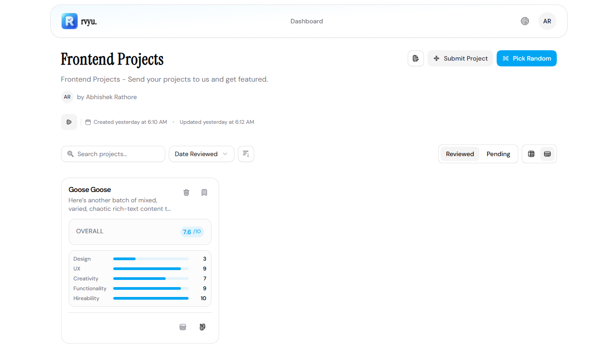

<div align="center">


# rvyu.

**The best way to collect & review projects.**

Stop digging through tweets and DMs. Create a list, share the link, and let your community submit their work for your next review.

[](LICENSE)
[](https://nextjs.org)
[](https://typescriptlang.org)
[](https://github.com/rathore-abhishek/rvyu)

[Live Demo](https://rvyu.vercel.app) · [Report Bug](https://github.com/rathore-abhishek/rvyu/issues) · [Request Feature](https://github.com/rathore-abhishek/rvyu/issues)



</div>

---

## What is rvyu?

rvyu is an open-source tool for creators, educators, and communities who want to collect and review project submissions — without the chaos of DMs, tweets, or spreadsheets.

- **Create lists** for different categories or review sessions
- **Share a link** so anyone can submit their project, no account needed
- **Review & rate** submissions across design, UX, creativity, and more
- **Save & organize** everything in one place

---

## Features

- **Multiple Lists** — Create and manage organized lists for different project categories or batches
- **Shareable Submission Links** — Anyone with the link can submit; no account required on their end
- **Project Bookmarking** — Save interesting submissions with one click to revisit later
- **Detailed Reviews & Ratings** — Rate projects across multiple criteria and leave written reviews
- **Rich Text Notes** — Powered by Tiptap editor for detailed project notes and descriptions
- **Table & List Views** — Switch between card and table layouts for browsing submissions
- **Google & GitHub OAuth** — Sign in instantly via better-auth
- **Email Auth** — Email/password sign up with verification emails via Nodemailer
- **File Uploads** — Project images and assets via UploadThing
- **Theme Toggle** — Light and dark mode with View Transition API animations
- **Search & Filter** — Find and sort submissions quickly

---

## Tech Stack

| Layer | Tech |
|---|---|
| Framework | Next.js 16 (App Router) |
| Language | TypeScript 5 |
| Styling | Tailwind CSS v4 |
| UI Components | Radix UI + shadcn/ui |
| Rich Text | Tiptap |
| Auth | better-auth |
| Data Fetching | TanStack Query v5 |
| Forms | TanStack Form + React Hook Form + Zod |
| Tables | TanStack Table |
| Database ORM | Drizzle ORM |
| Database | Neon (PostgreSQL serverless) |
| File Uploads | UploadThing |
| Email | Nodemailer |
| Animations | Motion |
| Notifications | Sonner |

---

## Project Structure

```
rvyu/
├── app/
│   ├── api/
│   │   ├── auth/[...all]/     # better-auth catch-all route
│   │   └── uploadthing/       # UploadThing file upload handler
│   ├── auth/
│   │   ├── login/             # Login page
│   │   └── signup/            # Signup page
│   ├── dashboard/             # Main authenticated dashboard
│   ├── lists/[id]/
│   │   └── submit/            # Public project submission page
│   └── users/[id]/            # User profile page
├── features/
│   ├── dashboard/             # Dashboard UI components
│   ├── landing/               # Hero, features, FAQ sections
│   ├── lists/                 # List creation, editing, display
│   ├── profile/               # User profile dialog
│   └── projects/              # Project cards, table, reviews, detail modal
├── components/
│   ├── common/                # Navbar, footer, theme toggle, mobile nav
│   ├── icons/                 # Custom SVG icon components
│   ├── providers/             # TanStack Query, theme, progress providers
│   └── ui/                    # Base UI primitives (shadcn)
├── actions/                   # Server actions (auth, email, user)
├── db/
│   ├── index.ts               # Drizzle client (Neon)
│   └── schema.ts              # Database schema
├── drizzle/                   # Migration SQL files
├── lib/                       # Auth config, email, upload, utils
├── types/                     # Shared TypeScript types
└── validation/                # Shared Zod schemas
```

---

## Getting Started

### Prerequisites

- [Bun](https://bun.sh) (recommended) or Node.js 18+
- A PostgreSQL database — the project uses [Neon](https://neon.tech) (serverless Postgres)
- OAuth apps for Google and/or GitHub
- An [UploadThing](https://uploadthing.com) account for file uploads
- An SMTP email account for verification emails

### 1. Clone the repo

```bash
git clone https://github.com/yourusername/rvyu.git
cd rvyu
```

### 2. Install dependencies

```bash
bun install
# or
npm install
```

### 3. Set up environment variables

Create a `.env` file in the root:

```env
# Database (Neon PostgreSQL connection string)
DATABASE_URL=

# better-auth
BETTER_AUTH_SECRET=        # run: openssl rand -base64 32
BETTER_AUTH_URL=           # e.g. http://localhost:3000

# Google OAuth
GOOGLE_CLIENT_ID=
GOOGLE_CLIENT_SECRET=

# GitHub OAuth
GITHUB_CLIENT_ID=
GITHUB_CLIENT_SECRET=

# Email (SMTP — for verification emails)
EMAIL_USER=
EMAIL_PASS=

# UploadThing
UPLOADTHING_TOKEN=
```

<details>
<summary>Where to get each value</summary>

| Variable | Where to get it |
|---|---|
| `DATABASE_URL` | [Neon console](https://console.neon.tech) — copy the connection string from your project |
| `BETTER_AUTH_SECRET` | Run `openssl rand -base64 32` in your terminal |
| `BETTER_AUTH_URL` | Your app's base URL — `http://localhost:3000` for local dev |
| `GOOGLE_CLIENT_ID/SECRET` | [Google Cloud Console](https://console.cloud.google.com) → APIs & Services → Credentials → Create OAuth 2.0 Client |
| `GITHUB_CLIENT_ID/SECRET` | GitHub → Settings → Developer settings → OAuth Apps → New OAuth App |
| `EMAIL_USER/PASS` | Your SMTP address and password (for Gmail, generate an [App Password](https://myaccount.google.com/apppasswords)) |
| `UPLOADTHING_TOKEN` | [UploadThing dashboard](https://uploadthing.com/dashboard) → your app → API Keys |

For Google and GitHub OAuth, set the authorized redirect URI to:

```
http://localhost:3000/api/auth/callback/google
http://localhost:3000/api/auth/callback/github
```

</details>

### 4. Push the database schema

```bash
bunx drizzle-kit push
# or
npx drizzle-kit push
```

This applies the schema from `db/schema.ts` directly to your Neon database.

### 5. Start the dev server

```bash
bun dev
# or
npm run dev
```

Open [http://localhost:3000](http://localhost:3000).

---

## Scripts

| Script | What it does |
|---|---|
| `bun dev` | Start the dev server |
| `bun build` | Build for production |
| `bun start` | Start the production server |
| `bun lint` | Run ESLint |
| `bun lint:fix` | Run ESLint with auto-fix |
| `bun format` | Format all files with Prettier |
| `bun format:check` | Check formatting without writing |
| `bun check:unused-icons` | Find unused icon files via Knip |

---

## Contributing

Contributions are welcome. Feel free to open an issue or submit a pull request.

1. Fork the repo
2. Create a branch: `git checkout -b feat/your-feature`
3. Commit: `git commit -m 'feat: add your feature'`
4. Push and open a PR

---

## License

MIT — see [LICENSE](LICENSE) for details.

---

<div align="center">

Shipped with ♥ by [Abhishek](https://github.com/rathore-abhishek)

*give a star please :3 — for cookie*

</div>
